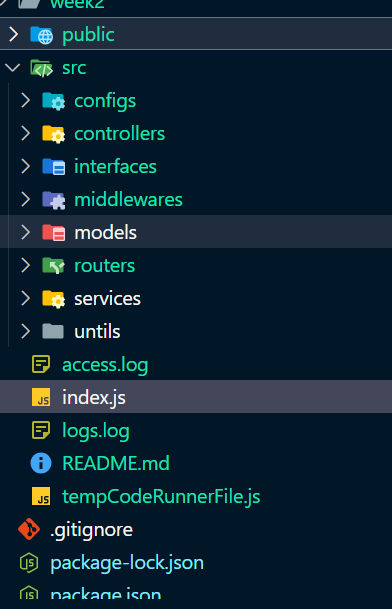
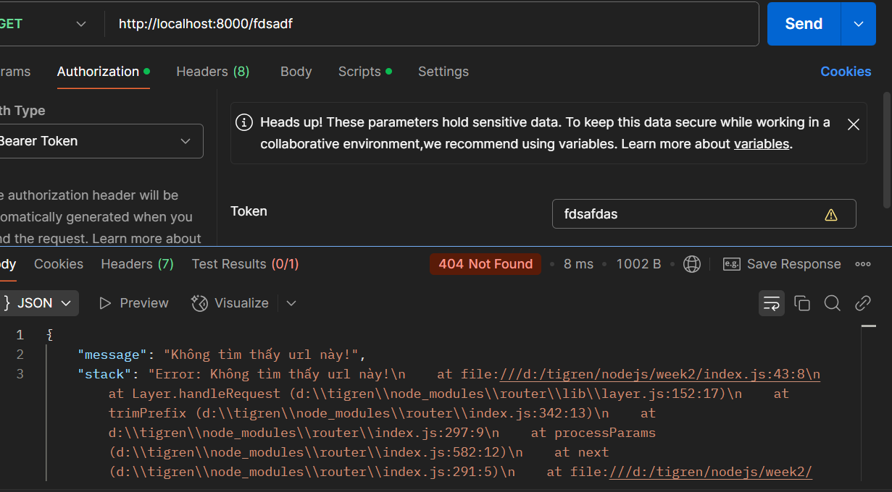

# My Internship Project

Morgan (một middleware logging cho Express.js) thường được sử dụng để ghi lại thông tin về các yêu cầu HTTP trong ứng dụng. Dưới đây là một số kiểu phổ biến.

- combined
  - Ghi lại thông tin chi tiết về mỗi yêu cầu, bao gồm IP client, thời gian thực hiện, method, URL, mã trạng thái HTTP, kích thước phản hồi, và user-agent.
- common
  - Ghi lại thông tin giống như combined, nhưng không có thông tin về referrer và user-agent.
- dev
  - Ghi lại thông tin trong chế độ phát triển, giúp bạn dễ dàng theo dõi các yêu cầu trong môi trường phát triển. Nó hiển thị thông tin ngắn gọn với màu sắc (tùy vào trạng thái HTTP) cho mỗi yêu cầu.
- short,tiny: Ghi lại thông tin ngắn gọn hơn.
- Custom format

  - Bạn có thể tạo định dạng log tùy chỉnh bằng cách truyền một chuỗi định dạng hoặc một hàm.

  ```js
  app.use(morgan(":method :url :status :response-time ms"));

  ----> GET /home 200 12ms
  ```

  Bài 1, hêm các middleware vào hệ thống API để xử lý các tác vụ như kiểm tra quyền truy cập, log hoạt động và xử lý lỗi

```js
import express from "express";
import fs from "fs";
import path, { dirname } from "path";
import { fileURLToPath } from "url";
import morgan from "morgan";
// / Lấy đường dẫn hiện tại (tương tự __dirname trong CommonJS)
const __filename = fileURLToPath(import.meta.url);
const __dirname = dirname(__filename);
const app = express();
const PORT = 8000;

// Tạo một stream để ghi log vào file
const logStream = fs.createWriteStream(path.join(__dirname, "logs.log"), {
  flags: "a",
});
// Cấu hình morgan để sử dụng format 'combined' và ghi vào log file
app.use(morgan("combined", { stream: logStream }));
class HttpError extends Error {
  constructor(status, message) {
    super(message);
    this.status = status;
  }
}
app.set("trust proxy", true); // Tin tưởng proxy để lấy header X-Forwarded-For
app.use(express.json());
app.use(express.urlencoded({ extended: true })); // Middleware để parse URL-encoded data
app.use((req, res, next) => {
  const token = req.headers["authorization"];
  if (!token) {
    return res.status(401).json({ message: "Unauthorized" });
  }
  next();
});

app.get("/", (req, res) => {
  res.statusCode = 200;
  res.send("Hello Worldfdsafdasfdas!");
});

// Route với lỗi 404
app.use((req, res, next) => {
  next(new HttpError(404, "Không tìm thấy url này!")); // Gọi next() với lỗi để chuyển đến middleware xử lý lỗi
});
//router lỗi chung
app.use((err, req, res, next) => {
  try {
    if (process.env.NODE_ENV !== "production") {
      console.error(err); // Ghi lỗi vào console nếu không phải môi trường sản xuất
      return res.status(err.status || 500).json({
        message: err.message,
        stack: err.stack, // Gửi thông tin stack trace nếu không phải môi trường sản xuất
      });
    } else {
      return res.status(err.status || 500).json({
        message: err.message,
        status: err.status || 500,
      });
    }
  } catch (error) {
    console.error("Lỗi ghi log:", error); // Ghi lỗi vào console nếu không thể ghi vào file
    res.status(500).send("Đã xảy ra lỗi khi xử lý yêu cầu của bạn."); // Gửi thông báo lỗi chung
  }
});

// Khởi động server
app.listen(PORT, () => {
  console.log(`Server is running at http://localhost:${PORT}`);
});
```

2, Sử dụng morgan để log thông tin các request HTTP với các loại log cơ bản.

- dev: Hiển thị thông tin ngắn gọn, dễ đọc trên console.
  
- combined: Log chi tiết hơn, thông tin về địa chỉ IP, URL, mã phản hồi và thời gian yêu cầu.
  
- tiny: Hiển thị thông tin rất ngắn gọn về status code và thời gian.
  

Cấu trúc thư mục chuẩn mvc


khi không có token

khi vào router không được định nghĩa

