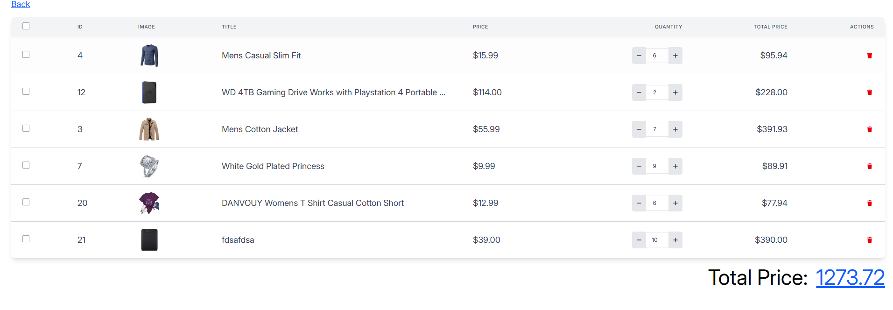
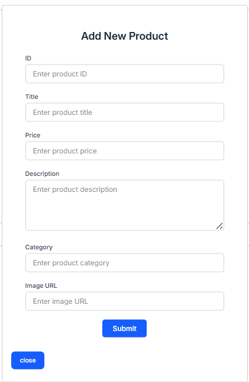

# E-Commerce Cart Implementation (Days 14-15)

A React-based e-commerce cart implementation with modern features and TypeScript integration.

## Project Structure

## Features

### 1. Product Management

- Display products in a responsive grid layout
- Lazy loading images for better performance
- Product details display with price formatting
- Add new products via modal form
- Form validation using Zod schema

### 2. Shopping Cart

- Add/remove items to/from cart
- Adjust quantities with increment/decrement controls
- Calculate total prices
- Multi-select items for bulk actions
- Persist cart data in localStorage
- Delete single or multiple items

### 3. Form Validation

- Input validation using Zod schema
- Real-time error feedback
- Required field validation
- URL validation for images
- Numeric validation for prices

## Key Components

### Product Listing (`index.tsx`)

- Fetches products from API
- Displays products in grid layout
- Integrates with shopping cart
- Modal for adding new products

### Cart Component (`cart.tsx`)

- Features:
  - Responsive table layout
  - Quantity adjustment controls
  - Item selection checkboxes
  - Total price calculation
  - Bulk delete functionality

### Product Form (`form_product.tsx`)

- Validates input using Zod schema
- Handles product creation
- Real-time validation feedback
- Responsive design

## Custom Hooks

### useCart Hook

```typescript
const useCart = () => {
  // Cart management logic
  return {
    addToCart,
    cart,
    setCart,
    totalPrice,
    deleteOneItemFromCart,
    deleteSelectedItem,
  };
};

// ...existing code...

## Demo Screenshots

### Product Listing Page
## Product Listing Page

*Product grid layout with lazy loading images and add to cart functionality*

## Shopping Cart

*Cart page showing selected items, quantity controls, and total calculation*

## Add Product Form

*Modal form for adding new products with validation*
```
