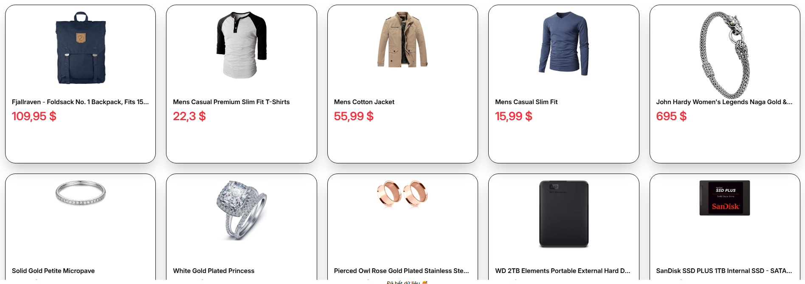
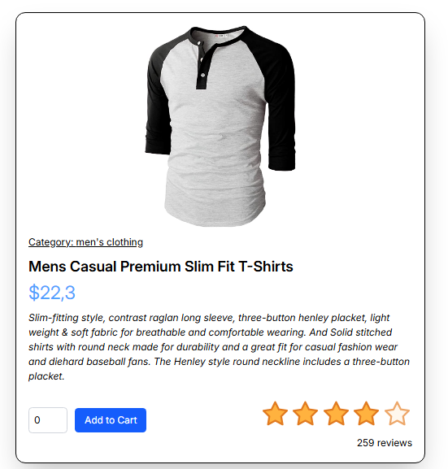
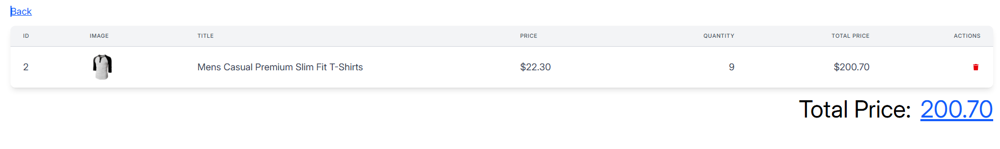

# Day 16 - E-Commerce Project with Context API

A React-based e-commerce application implementing Context API for state management, with TypeScript and modern React patterns.

## Project Structure

```
totalDay16/
├── contexts/
│   └── cartContext.tsx     # Cart context provider
├── hooks/
│   └── useContextCart.tsx  # Custom hook for cart management
├── day16/
│   ├── home.tsx           # Product listing page
│   ├── cart.tsx          # Shopping cart page
│   ├── interface.tsx     # TypeScript interfaces & Zod schemas
│   └── helpers/
│       └── formatMoney.ts # Money formatting utilities
└── products/
    ├── index.tsx         # Product card component
    └── [id].tsx          # Product detail page
```

## Features

### 1. Product Management

- Fetch and display products from external API (FakeStore API)
- Lazy loading images for better performance
- Responsive product grid layout
- Infinite scroll for product listing
- Star rating visualization

### 2. Shopping Cart

- Context API for state management
- Add/remove items functionality
- Quantity adjustment controls
- Real-time price calculations
- Cart data persistence
- Delete single/multiple items

### 3. Product Details

- Dynamic routing with params
- Detailed product information display
- Rating system with stars
- Quantity selection
- Add to cart functionality

## Key Components

### `CartContext` (`contexts/cartContext.tsx`)

```typescript
interface CartContextType {
  cart: ICart[];
  setCart: (v: ICart[]) => void;
  addItemIntoCart: (v: ICart) => void;
  totalPrice: number;
  removeItemFromCart: (id: number) => void;
}
```

### Product Interface (`interface.tsx`)

```typescript
export interface IProduct {
  id: number;
  title: string;
  price: number;
  description: string;
  category: string;
  image: string;
  rating: {
    rate: number;
    count: number;
  };
}
```

## Screenshots

### Product Listing Page


_Responsive product grid with infinite scroll_

### Product Details


_Detailed product view with ratings and add to cart_

### Shopping Cart


_Cart management with quantity controls_

## Technologies Used

- React 18
- TypeScript
- React Router v7
- Context API for state management
- Tailwind CSS for styling
- Zod for schema validation
- React Infinite Scroll Component
- FontAwesome icons
- React Rating Stars

## Best Practices

1. **State Management**

   - Centralized state with Context API
   - Type-safe implementations
   - Memoized calculations

2. **Performance**

   - Lazy loading images
   - Infinite scroll pagination
   - Component memoization

3. **Code Organization**

   - Modular component structure
   - Custom hooks for logic separation
   - TypeScript interfaces
   - Clean folder structure

4. **User Experience**
   - Responsive design
   - Loading states
   - Error handling
   - Intuitive navigation

## Getting Started

1. Install dependencies:

```bash
npm install
```

2. Run development server:

```bash
npm run dev
```

3. Access the application:

```
http://localhost:5173/day16
```

## Routes

- `/day16` - Product listing page
- `/day16/cart` - Shopping cart
- `/day16/:id` - Product detail page

## Future Improvements

1. Add search functionality
2. Implement filters and sorting
3. Add user authentication
4. Enhance error handling
5. Add loading states
6. Implement checkout process
7. Add product categories
