# Shopify App - Mini Project Documentation

## Authentication & OAuth

- Triển khai OAuth flow chuẩn.
- Lưu token vào DB (SQLite/MySQL).
- Middleware kiểm tra token cho toàn bộ API.

> **Lưu ý:** Remix đã xử lý phần này nên em chỉ cần hiểu luồng hoạt động.

---

## Product Listing - Sử dụng Shopify Admin API

- Gọi API lấy danh sách sản phẩm bằng GraphQL.

  ```graphql
  query ProductMetafield($ownerId: ID!) {
    shop {
      currencyCode
    }
    product(id: $ownerId) {
      title
      id
      category {
        id
        fullName
      }
      descriptionHtml
      hasOnlyDefaultVariant
      totalInventory
      vendor
      media(first: 10) {
        edges {
          node {
            mediaContentType
            alt
            ... on MediaImage {
              image {
                url(transform: { preferredContentType: WEBP })
              }
            }
          }
        }
      }
      variants(first: 50) {
        edges {
          node {
            selectedOptions {
              name
              value
            }
            id
            inventoryItem {
              id
              inventoryLevels(first: 10) {
                edges {
                  node {
                    quantities(names: ["available"]) {
                      quantity
                    }
                    location {
                      id
                      name
                    }
                  }
                }
              }
            }
            price
            compareAtPrice
            title
            inventoryQuantity
            media(first: 10) {
              edges {
                node {
                  alt
                  mediaContentType
                  __typename
                  ... on MediaImage {
                    id
                    image {
                      url(
                        transform: {
                          maxWidth: 300
                          maxHeight: 300
                          preferredContentType: WEBP
                        }
                      )
                    }
                  }
                }
              }
            }
          }
        }
      }
    }
  }
  ```

- Hiển thị bảng danh sách sản phẩm (Polaris DataTable):

  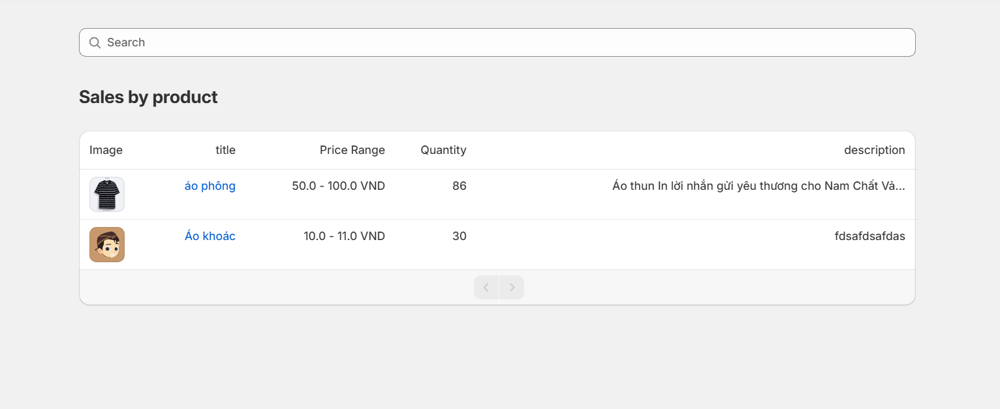

### Bonus: Phân trang & Tìm kiếm

- **Phân trang:** Sử dụng `previousCursor` và `nextCursor` để phân trang theo cursor-based pagination. Khi chuyển trang, cập nhật params để:
  1. Loader tự động lấy dữ liệu trang mới.
  2. Reload trang vẫn giữ nguyên vị trí phân trang.
- **Tìm kiếm:** Sử dụng query trong GraphQL, hỗ trợ tìm kiếm không phân biệt hoa thường và gần đúng (prefix search).

  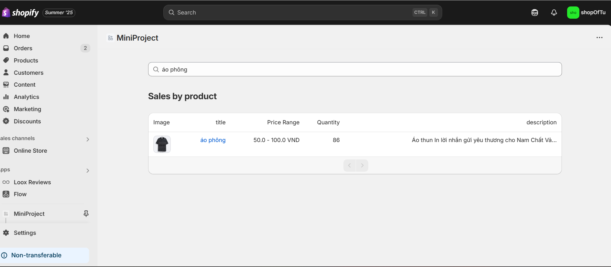

  - Khi search sẽ xóa các cursor phân trang để tránh kết quả null.
  - Áp dụng auto-complete cho tìm kiếm.

    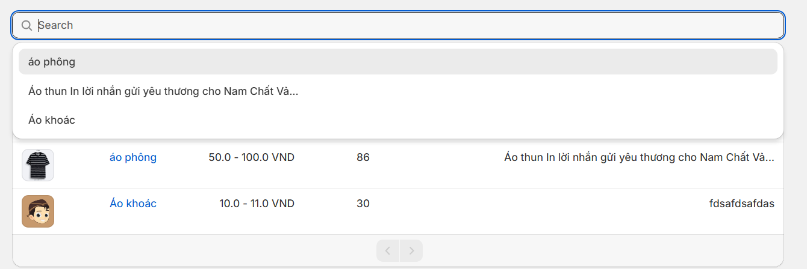

---

## Xem chi tiết sản phẩm

Trang chi tiết chia thành 2 layout:

- **Layout 1:** Hiển thị ảnh và thông tin ngắn (title, variant options, ...).

  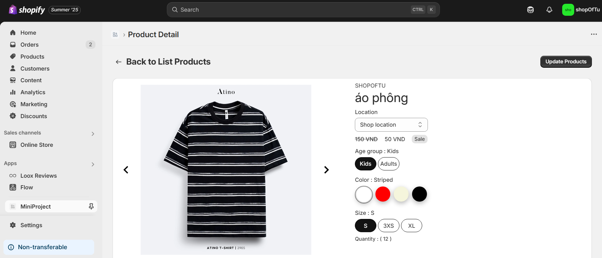

  - Sử dụng thư viện `react-slide` để hiển thị ảnh sản phẩm dạng slide. Khi người dùng chọn variant có ảnh khác, slide sẽ tự động cập nhật ảnh tương ứng.
  - Hiển thị thông tin chi tiết của product và các variant (tên, thuộc tính, giá, tồn kho, ...).
  - **Vấn đề gặp phải:** Xây dựng giao diện động cho danh sách variant.
    - Sử dụng kiểu dữ liệu `Record` để lưu trữ key-value các thuộc tính variant.
    - Tạo state `choseVariant` để lưu variant đang được chọn. Khi chọn variant, so sánh với danh sách các variant để sắp xếp lại, variant khớp nhiều thuộc tính nhất sẽ được ưu tiên hiển thị đầu tiên và được chọn.
    - Lưu variant đã chọn vào state `pickedVariant` để phục vụ cho các thao tác cập nhật tiếp theo như update price và quantity.

- **Layout 2:** Hiển thị mô tả sản phẩm (description) bằng HTML lấy từ Shopify.

  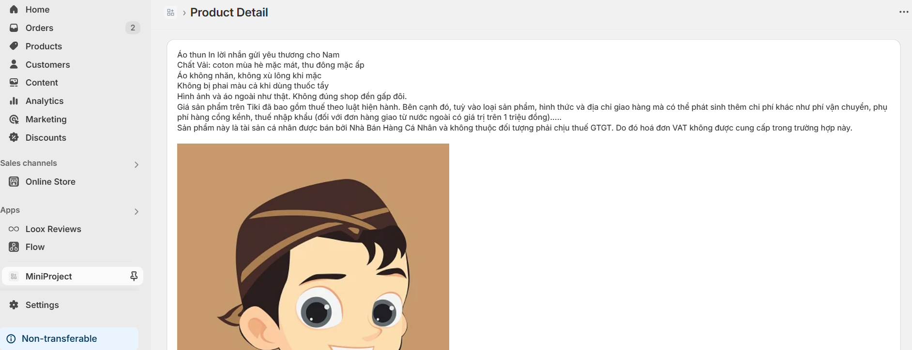

---

## Product Update - Giá & Tồn kho

- Form cập nhật giá/tồn kho sử dụng App Bridge và Polaris TextField.

  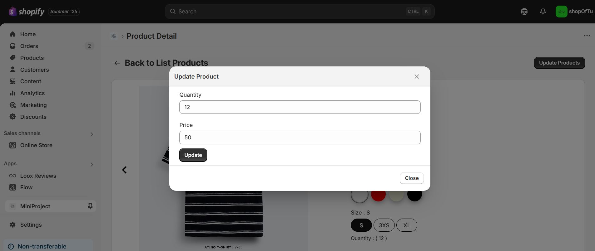

- **Validate đầu vào:** Sử dụng validate form của Polaris với 3 trường hợp:

  1. Giá là số âm hoặc chữ.
  2. Số lượng là số âm hoặc chữ.
  3. Không thay đổi giá hoặc số lượng thì báo lỗi submit.

- Ngoài ra, cần bổ sung trường `locationId` và `inventoryItemId` để cập nhật số lượng (`quantity`). Ở đây, em đã thiết kế một component `Select` trong trang chi tiết sản phẩm để hiển thị danh sách các địa điểm lưu trữ sản phẩm (locations), cho phép user chọn location cần cập nhật. Đối với `inventoryItemId`, mỗi variant chỉ có một `inventoryItemId` duy nhất nên sẽ lấy mặc định từ variant được chọn.
- **Gọi API Shopify để cập nhật:** Dùng fetcher gọi action định nghĩa trong route, truyền dữ liệu qua formData.

  ```js
  const handleSubmitUpdate = useCallback(() => {
    const isChangePrice = updatedVariant.price == pickedVariant?.node.price;
    const isChangeQuantity =
      updatedVariant.quantity == pickedVariant?.node.inventoryQuantity;
    if (isChangePrice && isChangeQuantity) {
      shopify.toast.show("You have to enter other quantity or price", {
        duration: 3000,
        isError: true,
      });
      return;
    }
    const formData = new FormData();
    if (!isChangePrice) {
      formData.set(VARIANTS.IS_UPDATE_PRICE, VARIANTS.IS_UPDATE_PRICE);
      formData.set(VARIANTS.PRODUCT_ID, productId);
      if (pickedVariant)
        formData.set(VARIANTS.PRODUCT_VARIANT_ID, pickedVariant?.node.id);
      formData.set(VARIANTS.QUANTITY, updatedVariant.quantity);
      formData.set(VARIANTS.PRICE, updatedVariant.price);
    }
    if (!isChangeQuantity) {
      const inventoryItemId = pickedVariant?.node?.inventoryItem?.id;
      const locationId = selected;
      formData.set(VARIANTS.IS_UPDATE_QUANTITY, VARIANTS.IS_UPDATE_QUANTITY);
      formData.set(VARIANTS.INVENTORY_ITEM_ID, inventoryItemId ?? "");
      formData.set(VARIANTS.LOCATION_ID, locationId ?? "");
      formData.set(
        VARIANTS.QUANTITY,
        pickedVariant?.node?.currentInventoryQuantity?.toString() ?? "",
      );
      formData.set(VARIANTS.UPDATE_QUANTITY, updatedVariant?.quantity);
    }

    fetcher.submit(formData, {
      method: "post",
    });
  }, [pickedVariant, updatedVariant]);
  ```

- **Vấn đề gặp phải:**

  - Giá: cập nhật dễ, API rõ ràng.
  - Số lượng: cập nhật khó, cần inventoryItemId và locationId (1 variant có 1 inventoryItemId, 1 sản phẩm có thể có nhiều kho).
  - Validate các input như variantId,inventoryItemId,productId, quantity,...

- **Tối ưu hóa:** Sử dụng `Promise.allSettled` để gọi API đồng thời.

- **Hiển thị Toast Polaris khi thành công/thất bại:**

  - Lỗi response: custom lại theo type userErrors (field, message).
  - Lỗi Error: dùng component ErrorBoundary để hiển thị.

  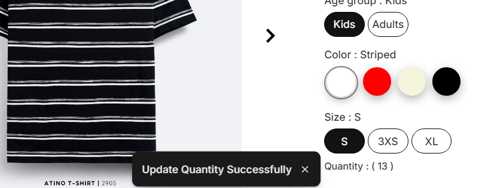
  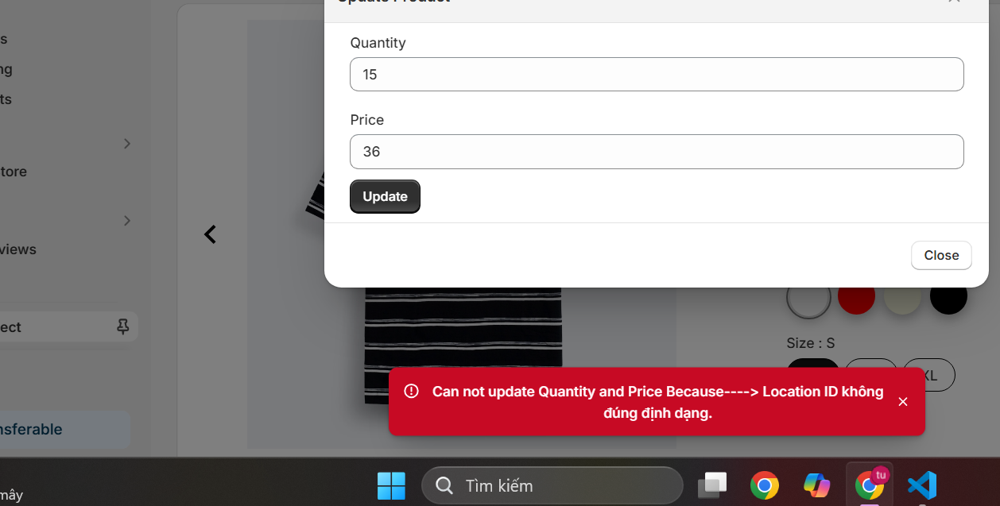

---

## Theme Interaction - App Block hoặc ScriptTag

- Hiển thị:

  - Giá gốc
  - Giá khuyến mãi
  - Thông điệp "Còn X sản phẩm trong kho"

  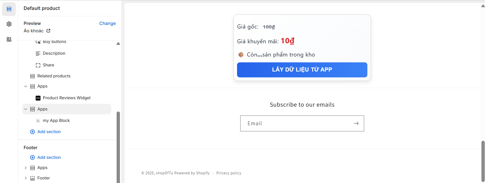
  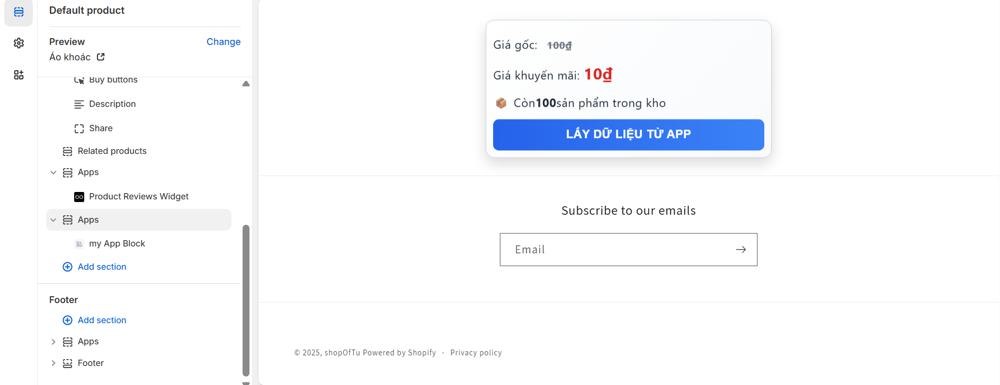

---

## Webhook - Product Delete

- Đăng ký webhook qua API:

  ```graphql
  mutation webhookSubscriptionCreate(
    $topic: WebhookSubscriptionTopic!
    $webhookSubscription: WebhookSubscriptionInput!
  ) {
    webhookSubscriptionCreate(
      topic: $topic
      webhookSubscription: $webhookSubscription
    ) {
      webhookSubscription {
        id
        topic
        filter
        format
        endpoint {
          __typename
          ... on WebhookHttpEndpoint {
            callbackUrl
          }
        }
      }
      userErrors {
        field
        message
      }
    }
  }
  ```

  **Variables:**

  ```json
  {
    "topic": "PRODUCTS_DELETE",
    "webhookSubscription": {
      "callbackUrl": "https://adapted-possibly-eagle-dodge.trycloudflare.com/webhooks/app/delete_product",
      "format": "JSON"
    }
  }
  ```

- Khi xóa sản phẩm, từ payload webhook nhận được, ghi id sản phẩm bị xóa vào database (dùng Prisma ORM) cùng các thông tin khác như shopName,...

  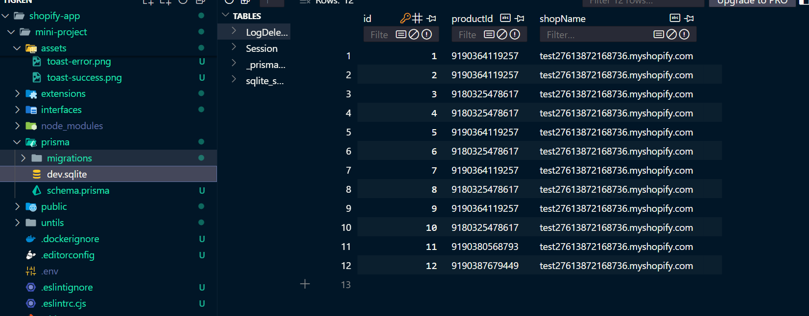

---

## Dashboard thống kê (Polaris)

- Dùng Shopify GraphQL lấy dữ liệu: số sản phẩm, tồn kho, số lượng sản phẩm đang giảm giá.

  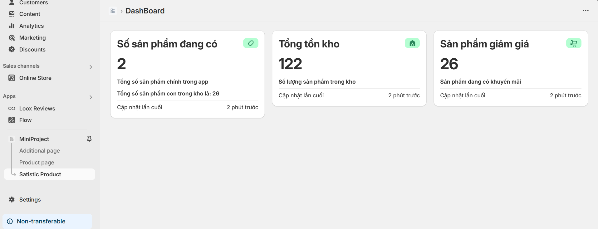

---

## Responsive

- **Chi tiết sản phẩm:**

  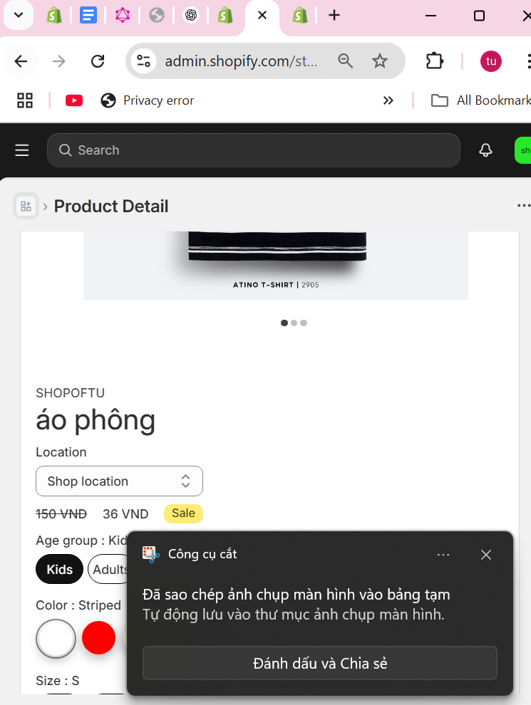

- **Dashboard:**

  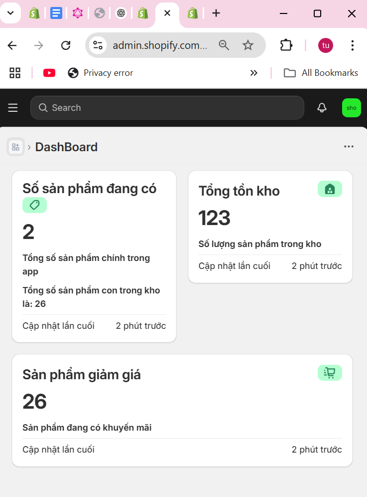
