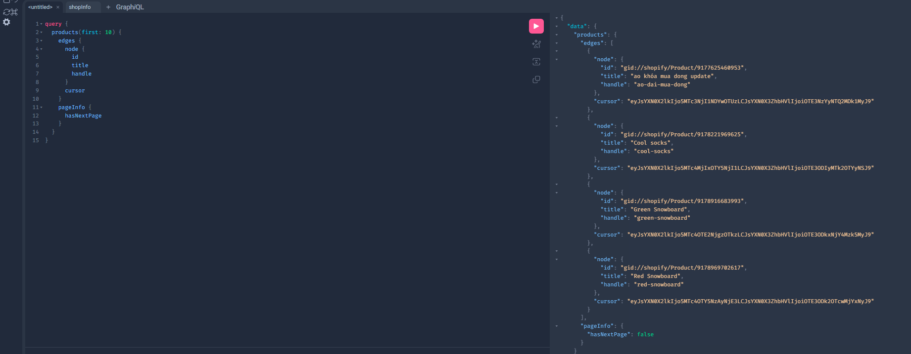
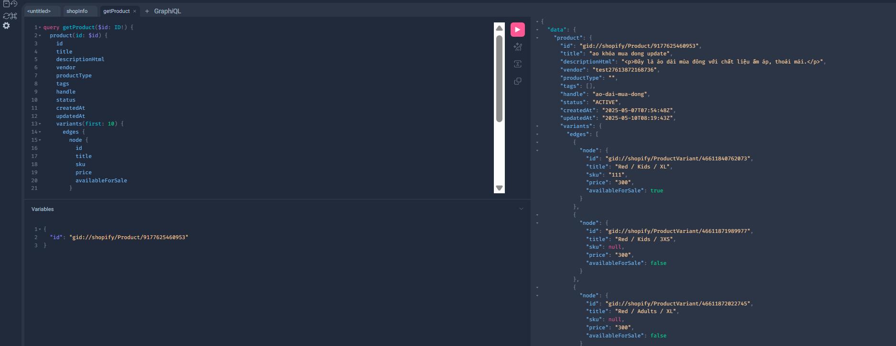

# Shopify API Development Guide

## 📌 Table of Contents

- [API Types Comparison](#api-types-comparison)
- [Core APIs Overview](#core-apis-overview)
- [API Limitations](#api-limitations)
- [Authentication & Authorization](#authentication--authorization)
- [Error Handling](#error-handling)
- [Testing with Postman](#testing-with-postman)

## 🔄 API Types Comparison

### REST API vs GraphQL API

| Feature            | REST API           | GraphQL API      |
| ------------------ | ------------------ | ---------------- |
| Data Fetching      | Multiple endpoints | Single endpoint  |
| Response Structure | Fixed              | Flexible         |
| Version            | 2023-01            | Latest           |
| Rate Limits        | Per endpoint       | Query cost-based |
| Learning Curve     | Simple             | Moderate         |

### When to Use Each

- **REST API**:
  - Simple CRUD operations
  - Specific resource needs
  - Webhook implementations
- **GraphQL**:
  - Complex data requirements
  - Multiple resource fetching
  - Specific field selection

## 🔑 Core APIs Overview

### Product API

```graphql
query {
  products(first: 10) {
    edges {
      node {
        id
        title
        variants {
          price
          sku
        }
      }
    }
  }
}
```

### Customer API

```graphql
query {
  customers(first: 10) {
    edges {
      node {
        id
        email
        firstName
        lastName
      }
    }
  }
}
```

### Order API

```graphql
query {
  orders(first: 10) {
    edges {
      node {
        id
        totalPrice
        customer {
          email
        }
      }
    }
  }
}
```

## ⚠️ API Limitations

### Rate Limits

- REST API: 2 requests/second
- GraphQL: 1000 cost/second
- Bulk Operations: 1 operation/60 seconds

### Cost Calculation Example

```graphql
# Total Cost: 156
{
  products(first: 10) {
    # 50 points
    edges {
      node {
        variants(first: 10) {
          # 10 * 10 = 100 points
          title # 1 point
          price # 1 point
        }
      }
    }
  }
}
```

## 🔒 Authentication & Authorization

### OAuth Flow

1. App Installation
2. Redirect to Auth Page
3. Get Authorization Code
4. Exchange for Access Token

```javascript
// OAuth Example
const shopifyAuth = async (shop) => {
  const authUrl = `https://${shop}/admin/oauth/authorize?client_id=${API_KEY}&scope=${SCOPES}&redirect_uri=${REDIRECT_URI}`;
  return authUrl;
};
```

### Required Scopes

- `read_products`, `write_products`
- `read_customers`, `write_customers`
- `read_orders`, `write_orders`

## ❌ Common Errors & Solutions

### 1. Rate Limit Exceeded

```javascript
// Retry Logic Example
const apiCall = async (retries = 3) => {
  try {
    return await makeRequest();
  } catch (error) {
    if (error.status === 429 && retries > 0) {
      await delay(1000);
      return apiCall(retries - 1);
    }
    throw error;
  }
};
```

### 2. Missing Scopes

- Error: `403 Forbidden`
- Solution: Request proper scopes during installation

### 3. Invalid Data

- Validate input before API calls
- Handle missing required fields

## 🧪 Testing with Postman

### Setup

1. Create new collection
2. Set environment variables:
   - `SHOP_URL`
   - `ACCESS_TOKEN`
   - `API_VERSION`

### Example Request

```http
GET {{SHOP_URL}}/admin/api/{{API_VERSION}}/products.json
Headers:
X-Shopify-Access-Token: {{ACCESS_TOKEN}}
```

### Collection Variables

```json
{
  "SHOP_URL": "your-store.myshopify.com",
  "API_VERSION": "2023-01",
  "ACCESS_TOKEN": "shpat_..."
}
```

## 📚 Best Practices

1. **Rate Limiting**

   - Implement retry logic
   - Use bulk operations for large datasets
   - Cache responses when possible

2. **Error Handling**

   - Validate input data
   - Implement proper logging
   - Use try-catch blocks

3. **Security**
   - Store tokens securely
   - Validate webhook signatures
   - Use HTTPS endpoints

## 🔗 Useful Resources

- [Shopify API Documentation](https://shopify.dev/api)
- [GraphQL Admin API](https://shopify.dev/api/admin-graphql)
- [API Versioning Guide](https://shopify.dev/api/usage/versioning)

## 🔑 Core APIs Overview

### Product API Examples

#### Get All Products



#### Get Product Details



Oauth Flow

## 🔒 OAuth Authentication in Shopify

### What is OAuth?

OAuth 2.0 is a protocol that allows third-party apps to access a user’s data without getting their password, using an access token.

The user clicks "Log in with Third-Party App"
→ They are redirected to the third-party authentication page.

The user logs in to the third-party service and grants permissions
→ The third-party service redirects back to your application with an authorization code.

Your application exchanges the authorization code for an access_token
→ This token can be used to call the third-party's API.

Your application uses the access_token to fetch the user's information
→ For example: name, email, profile picture, etc.
