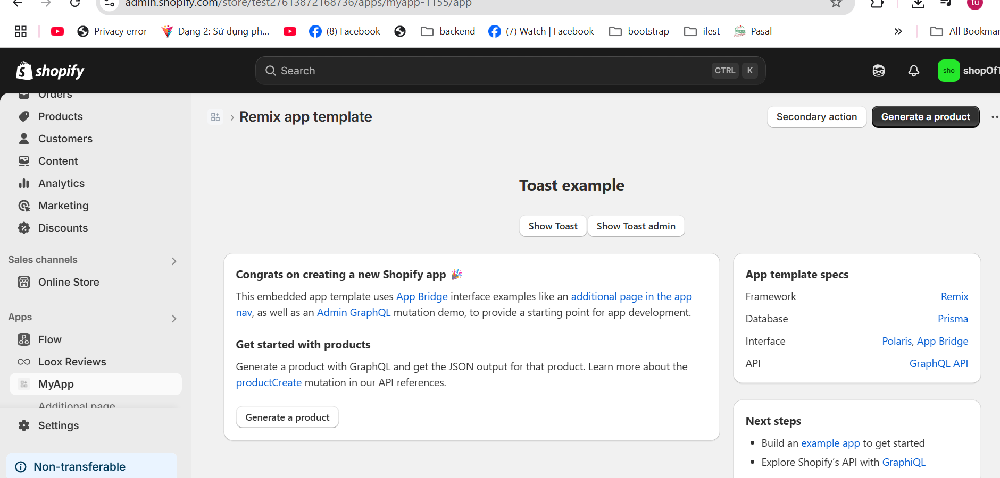
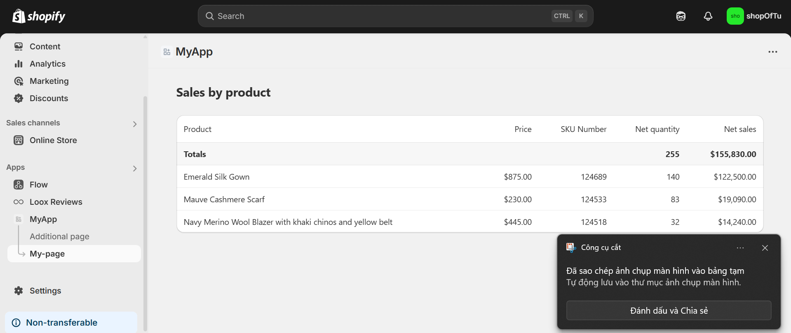

# Shopify CLI & Project Setup Guide

## 📦 Installing Shopify CLI

### Prerequisites

- Node.js >= 16.0.0
- npm >= 8.0.0
- Ruby >= 2.7 (Windows only)

### Installation Steps

2. **Install Shopify CLI**

```bash
npm init @shopify/app@latest
```

3. **Verify Installation**

```bash
shopify version
```

## 🚀 Creating a New Shopify App

// ...existing code...

## 🖼️ Application Screenshots

### Local Development View


_Application running in local development environment_

### App Page View


_Main application page interface_

// ...continue with existing code...

### Initialize Project

```bash
npm init @shopify/app@latest my-shopify-app
cd my-shopify-app
```

### Project Structure

```
📦 my-shopify-app
├── 📂 web/                  # Frontend React application
│   ├── 📂 frontend/
│   │   ├── 📂 components/  # React components
│   │   ├── 📂 pages/      # App pages
│   │   └── 📂 assets/     # Static files
│   │
│   ├── 📂 index.js        # Entry point
│   └── 📂 package.json    # Frontend dependencies
│
├── 📂 extensions/          # Shopify extensions
│   ├── 📂 theme-extension/
│   └── 📂 function/
│
├── 📂 shopify.app.toml    # App configuration
└── 📂 package.json        # Root dependencies
```

## 🛠️ Key Directories Explained

### `/web` Directory

- Main React application
- Uses Shopify App Bridge
- Polaris components
- Frontend logic

### `/extensions` Directory

- Theme app extensions
- Function extensions
- App blocks

### Configuration Files

- `shopify.app.toml`: App configuration
- `.env`: Environment variables
- `package.json`: Dependencies

## 🔧 Development Setup

1. **Start Development Server**

```bash
npm run dev
```

2. **Environment Variables**

```env
SHOPIFY_API_KEY=your_api_key
SHOPIFY_API_SECRET=your_api_secret
SCOPES=write_products,read_orders
HOST=your-ngrok-url
```

3. **Install Dependencies**

```bash
npm install
```

## 📝 Common CLI Commands

```bash
# Create new app
shopify app create

# Start development server
shopify app dev

# Deploy app
shopify app deploy

# Generate new extension
shopify app generate extension

# View app status
shopify app info
```

## ⚙️ Configuration

### App Bridge Setup

```javascript
// web/frontend/App.jsx
import { Provider } from "@shopify/app-bridge-react";

const config = {
  apiKey: process.env.SHOPIFY_API_KEY,
  host: new URL(location).searchParams.get("host"),
  forceRedirect: true,
};
```

### Polaris Setup

```javascript
// web/frontend/index.jsx
import { AppProvider } from "@shopify/polaris";
import enTranslations from "@shopify/polaris/locales/en.json";
```

## 🔍 Development Tools

1. **Shopify CLI Commands**

   - `shopify theme serve`
   - `shopify app generate`
   - `shopify app deploy`

2. **VS Code Extensions**

   - Shopify Liquid
   - GraphQL
   - ESLint

## 🐛 Troubleshooting

Common Issues:

1. Port conflicts
2. Authentication errors
3. Extension loading issues

Solutions:

```bash
# Clear CLI cache
shopify cache clean

# Reset development store
shopify app reset

# Check CLI logs
shopify logs
```
