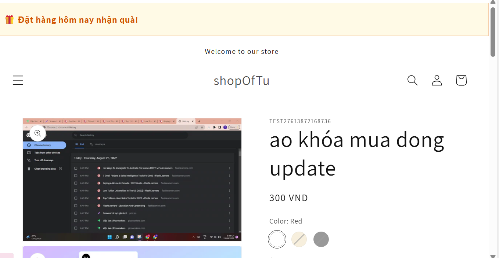
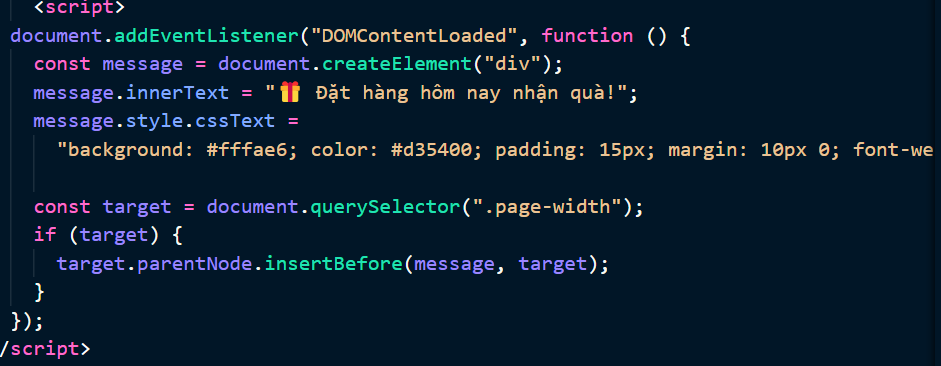
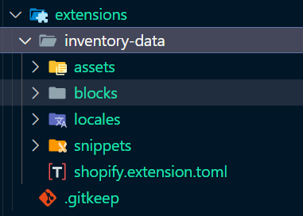
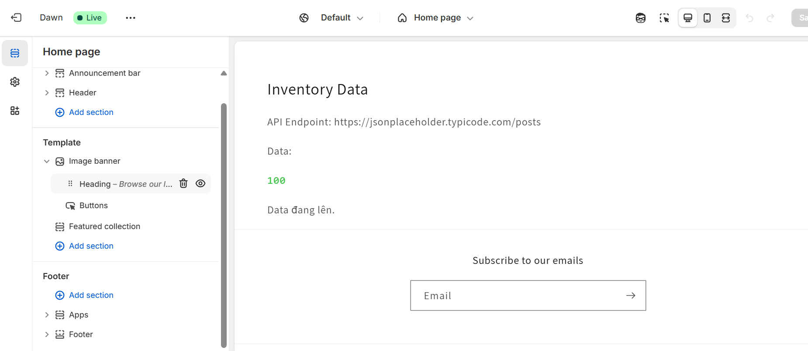

# Shopify Theme Development Guide

## 📚 Table of Contents

- [Theme Overview](#theme-overview)
- [Liquid Template Language](#liquid-template-language)
- [Sections & Blocks](#sections--blocks)
- [JSON Templates](#json-templates)
- [App Integration](#app-integration)

## 🎨 Theme Overview

### Theme Structure

```
📦 theme
├── 📂 assets/
│   ├── application.js
│   └── application.css
├── 📂 config/
│   └── settings_schema.json
├── 📂 layout/
│   └── theme.liquid
├── 📂 sections/
│   ├── header.liquid
│   └── footer.liquid
├── 📂 snippets/
│   └── product-card.liquid
└── 📂 templates/
    ├── index.json
    └── product.json
```

## 💧 Liquid Template Language

### Basic Syntax

```liquid

  Hello {{ customer.name }}!

  Please log in

```

### Objects & Filters

```liquid
{{ product.title | upcase }}
{{ product.price | money_format }}
```

### Loops

```liquid

  {{ product.title }}

```

## 🧩 Sections & Blocks

### Section Example

```liquid

{
  "name": "Product Features",
  "settings": [
    {
      "type": "text",
      "id": "title",
      "label": "Section Title"
    }
  ],
  "blocks": [
    {
      "type": "feature",
      "name": "Feature",
      "settings": [
        {
          "type": "text",
          "id": "heading",
          "label": "Feature Title"
        }
      ]
    }
  ]
}

```

## 📄 JSON Templates

### Product Template

```json
{
  "sections": {
    "main": {
      "type": "main-product",
      "settings": {
        "show_quantity": true,
        "show_variants": true
      }
    }
  },
  "order": ["main"]
}
```

## 🔌 App Integration

### Script Tags

```javascript
// Add script tag to theme
const scriptTag = await shopify.rest.ScriptTag.create({
  session: session,
  event: "onload",
  src: "https://my-app.com/script.js",
});
```

### App Blocks

```liquid

{
  "name": "App Block",
  "target": "section",
  "settings": [
    {
      "type": "text",
      "id": "heading",
      "label": "Heading"
    }
  ]
}

```

## 🔧 Development Tools

### Theme CLI Commands

```bash
# Start development server
shopify theme serve

# Push theme changes
shopify theme push

# Pull theme updates
shopify theme pull
```

### App Block Installation

1. Register in app settings
2. Add to theme sections
3. Configure in theme editor

## 🎯 Best Practices

### Performance

- Minimize liquid operations
- Use CSS/JS bundling
- Lazy load images
- Cache API responses

### Theme Security

- Validate user input
- Escape output
- Use CSP headers
- Sanitize data

### App Integration

- Use async script loading
- Implement graceful fallbacks
- Follow Shopify guidelines
- Test across themes

## 📱 Responsive Design

### Media Queries

```css
@media screen and (max-width: 749px) {
  .section {
    padding: 1rem;
  }
}
```

### Responsive Images

```liquid

```

## 🐛 Troubleshooting

Common Issues:

1. Theme Editor not updating
2. Script tags not loading
3. App blocks not appearing

Solutions:

```bash
# Clear theme cache
shopify theme cache clear

# Check theme logs
shopify theme logs

# Validate theme
shopify theme check
```

## 🔌 App Integration

### Script Tags



```javascript
// Add script tag to theme
const scriptTag = await shopify.rest.ScriptTag.create({
  session: session,
  event: "onload",
  src: "https://my-app.com/script.js",
});

//add script tag to theme by inject directionly
```



### App Blocks



```liquid

{
  "name": "App Block",
  "target": "section",
  "settings": [
    {
      "type": "text",
      "id": "heading",
      "label": "Heading"
    }
  ]
}

```


