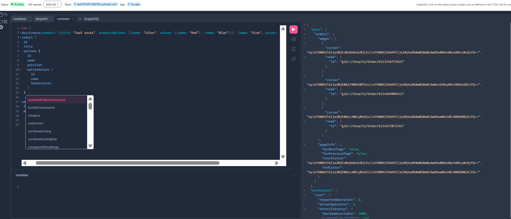

Hiểu được OAuth 2.0 + xác thực + bảo mật flow trong Shopify App

- đầu tiên merchant vào app , thì app sẽ redirect đến trang admin url sẽ đi kèm theo shop , redirect_url , scopes,..
- khi merchant đồng ý quyền , thì app sẽ redirect trang về url mà mình định nghĩa , đi cùng với code , mã hmac , time,state, ...
- ở đây app phải sắp xếp lại params theo bảng chữ cái , trừ hmac, sau đó mã hóa chuỗi đó, rồi so sánh với hmac gốc , nếu match thì url là hợp lệ và chưa bị chỉnh sửa dữ liệu trên đường truyền. ngoài ra , còn so sánh state để đảm bảo url là hợp lệ.
- sau đó app lấy code để thực hiện truy vấn lấy accessToken và lưu trữ thông tin vào sessionStore được định nghĩa , ở đây là database.
- khi fe cần request xuống server , thì fe phải qua app bridge để lấy sessionToken(ở đây theo em hiểu là khi merchant cài app thì app của mình được nhúng bên trong iframe của admin cùng với bridge app , bridge app có nhiệm vụ lây dữ liệu gồm store domain và userId để tạo sessionToken).
- fe sau khi lấy được sessionToken thì gửi xuống be để xác thực , be dùng scret_key để giải mã sessionToken,và lấy aud sau khi giải mã , so sánh với api_key của app hiện tại , nếu match thì hợp lệ để đảm bảo chỉ có app đó mới giải mã được sessionToken, app khác thì không(tránh tái sử dụng token), sau đó lấy thông tin như shop domain và userId để query xuống db lấy accessToken phù hợp.
- sau đó be dùng accessToken để query api admin , trả dữ liệu cho fe.
  // ...existing code...

## 🔑 API & Authentication

### Access Token Management

Learn how to manage access tokens for Shopify API authentication:

### Admin GraphQL API

Example of using the Shopify Admin GraphQL API:

### Best Practices for API Usage

- Store tokens securely
- Implement proper error handling
- Use rate limiting
- Cache responses when possible
- Monitor API usage limits
