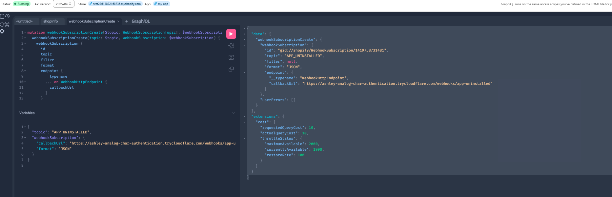
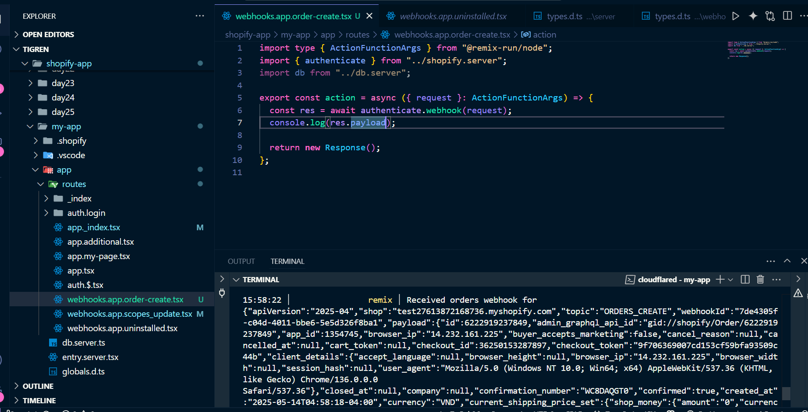

- Webhook trong Shopify là một cơ chế để nhận thông báo từ Shopify mỗi khi có một sự kiện xảy ra trong store (ví dụ: đơn hàng mới, app bị gỡ, sản phẩm bị cập nhật...).

  Ví dụ về sự kiện Webhook phổ biến

```markdown
| Sự kiện (topic) | Ý nghĩa                      |
| --------------- | ---------------------------- |
| APP_UNINSTALLED | App của bạn bị gỡ khỏi store |
| ORDERS_CREATE   | Có đơn hàng mới được tạo     |
| PRODUCTS_UPDATE | Sản phẩm bị chỉnh sửa        |
```

Đăng ký webhook (REST & GraphQL)

----------------->rest
api:
/admin/api/2025-07/webhooks.json

```bash
curl -d '{
    "webhook": {
        "address": "pubsub://projectName:topicName",
        "topic": "customers/update",
        "format": "json"
    }
}' \
-X POST "https://your-development-store.myshopify.com/admin/api/2025-07/webhooks.json" \
-H "X-Shopify-Access-Token: {access_token}" \
-H "Content-Type: application/json"
```

**Response:**

```http
HTTP/1.1 201 Created
{
    "webhook": {
        "id": 8589936327,
        "address": "pubsub://projectName:topicName",
        "topic": "customers/update",
        "created_at": "2025-04-01T14:41:47-04:00",
        "updated_at": "2025-04-01T14:41:47-04:00",
        "format": "json",
        "fields": [],
        "metafield_namespaces": [],
        "api_version": "unstable",
        "private_metafield_namespaces": [],
        "metafield_identifiers": []
    }
}
```

---------------------------->GraphQL

```graphql
mutation webhookSubscriptionCreate(
    $topic: WebhookSubscriptionTopic!,
    $webhookSubscription: WebhookSubscriptionInput!
) {
    webhookSubscriptionCreate(topic: $topic, webhookSubscription: $webhookSubscription) {
        webhookSubscription {
            id
            topic
            filter
            format
            endpoint {
                __typename
                ... on WebhookHttpEndpoint {
                    callbackUrl
                }
            }
        }
        userErrors {
            field
            message
        }
    }
}

# Variables
{
    "topic": "METAOBJECTS_CREATE",
    "webhookSubscription": {
        "callbackUrl": "https://example.org/endpoint",
        "format": "JSON"
    }
}

# Response
{
    "webhookSubscriptionCreate": {
        "webhookSubscription": {
            "id": "gid://shopify/WebhookSubscription/8589934635",
            "topic": "METAOBJECTS_CREATE",
            "filter": "type:lookbook",
            "format": "JSON",
            "endpoint": {
                "__typename": "WebhookHttpEndpoint",
                "callbackUrl": "https://example.org/endpoint"
            }
        },
        "userErrors": []
    }
}
```

Để xử lý webhook trong Remix App (dùng @shopify/shopify-app-remix)

1. Đăng ký webhook trong shopify.app.toml or api (restfull or graphql)
2.

```
[webhooks]
  [[webhooks.subscriptions]]
  topic = "APP_UNINSTALLED"
  path = "/webhooks/app-uninstalled"
```

Tạo file route trong Remix: vd: /routes/webhooks/app-uninstalled.tsx

```
// app/routes/webhooks/app-uninstalled.tsx
import type { ActionFunctionArgs } from "@remix-run/node";
import { shopify } from "~/shopify.server";

export const action = async ({ request }: ActionFunctionArgs) => {
return await shopify.processWebhookRequest(request);
};
```

- ở đây app xử lý và lấy payload để xử lý.

## 🔔 Webhooks

### Creating Webhooks

Learn how to set up webhooks in your Shopify app using GraphQL:



### Webhook Data Handling

Example of webhook data received in the console:



### Best Practices for Webhooks

- Verify webhook authenticity using HMAC validation
- Implement proper error handling
- Use queues for webhook processing
- Set up retry mechanisms
- Monitor webhook delivery rates
