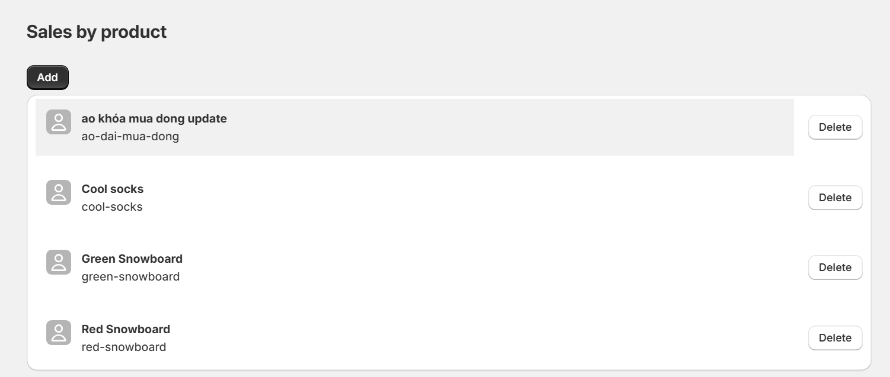
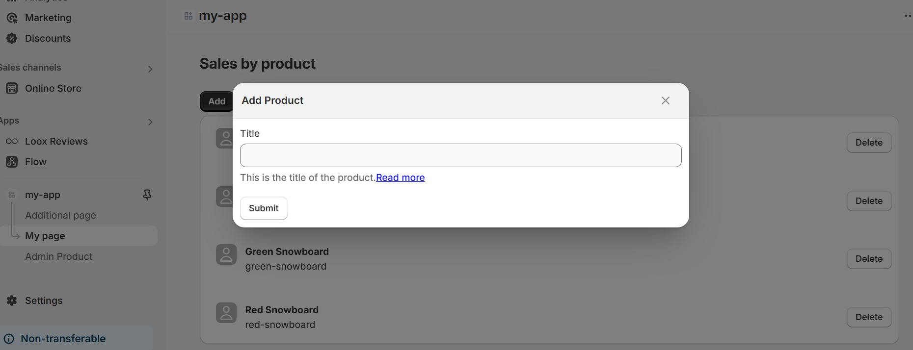
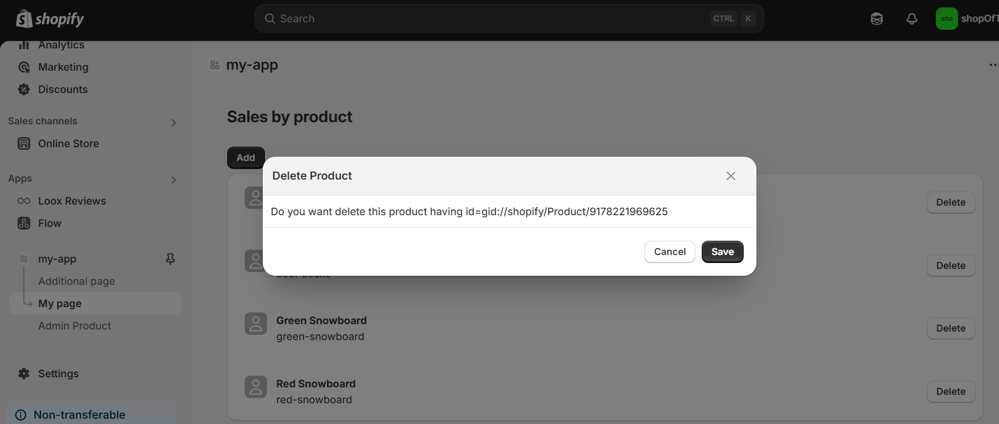

# Shopify App Development Guide

## 📱 App Features

### Overview

Get a comprehensive view of the app's main features and functionality:



### Adding New Items

Learn how to add new items and manage data:



### Deletion Process

Understanding how to safely remove items:



## 🔑 Best Practices

### Data Management

- Always validate input data
- Implement proper error handling
- Use appropriate data structures
- Follow CRUD best practices

### Security Guidelines

- Implement authentication
- Validate user permissions
- Secure API endpoints
- Regular security audits

## 🚀 Getting Started

### Installation

```bash
npm install
npm run dev
```

### Configuration

```bash
cp .env.example .env
# Update environment variables
```

### Development

```bash
npm run build
npm start
```
