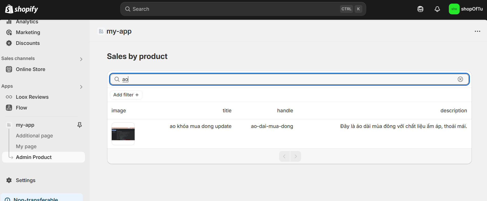
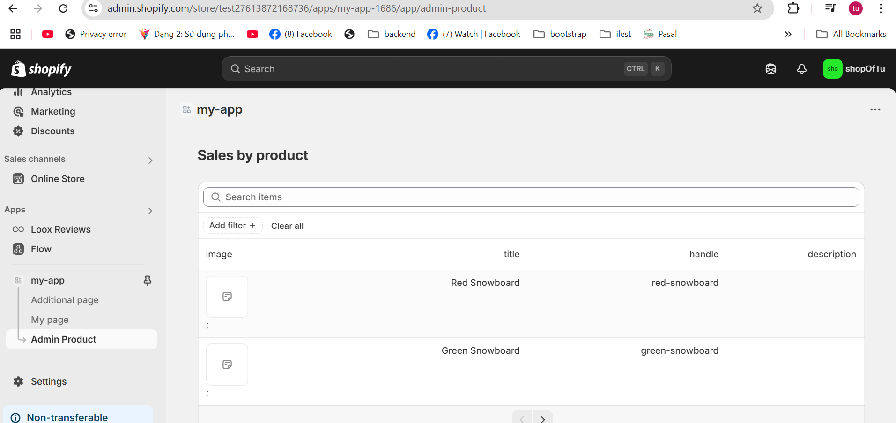
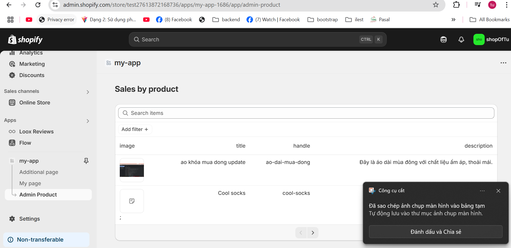

## useAppBridge – Kết nối với Shopify App Bridge

**Mục đích:**  
Cung cấp quyền truy cập vào Shopify App Bridge – SDK cho phép tương tác với UI và context của Shopify (shop, host, API...).

**Cách dùng:**

```js
import { useAppBridge } from "@shopify/app-bridge-react";

const app = useAppBridge();
```

**Ứng dụng:**

- Lấy thông tin shop, host hiện tại.
- Tạo redirect, modal, toast...
- Làm context cho các hành động bảo mật như fetch.

---

## useAuthenticatedFetch – Gửi request đến backend đã xác thực

**Mục đích:**  
Gửi request từ frontend đến backend riêng của app, kèm token xác thực hợp lệ.  
Bạn không cần tự thêm header `Authorization` bằng tay.

**Cách dùng:**

```js
import { useAuthenticatedFetch } from "~/hooks";

const fetch = useAuthenticatedFetch();

useEffect(() => {
  fetch("/api/products")
    .then((res) => res.json())
    .then((data) => console.log(data));
}, []);
```

**Cách hoạt động:**  
Tự động thêm header `Authorization: Bearer <session-token>` nếu cần.

# Hướng dẫn phát triển ứng dụng Shopify

// ...mã hiện có...

## 🔍 Tìm kiếm & Lọc dữ liệu

### Chức năng tìm kiếm

Triển khai tính năng tìm kiếm mạnh mẽ trong ứng dụng của bạn:



### Tuỳ chọn lọc

Thêm các tuỳ chọn lọc nâng cao để cải thiện trải nghiệm người dùng:



### Phân trang

Triển khai phân trang hiệu quả cho các tập dữ liệu lớn:



### Các lưu ý khi xây dựng tìm kiếm & lọc

- Thực hiện debounce cho ô nhập tìm kiếm
- Cache dữ liệu truy cập thường xuyên
- Hỗ trợ nhiều tổ hợp bộ lọc
- Thêm tuỳ chọn xoá bộ lọc rõ ràng
- Hiển thị trạng thái loading khi tìm kiếm
- Sử dụng params để lưu trạng thái cursor hiện tại, giúp tải thêm trang mà không mất trạng thái phân trang
